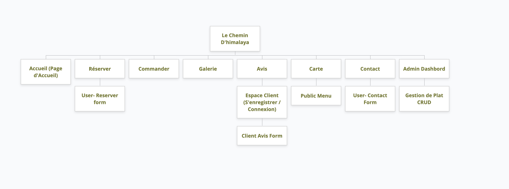
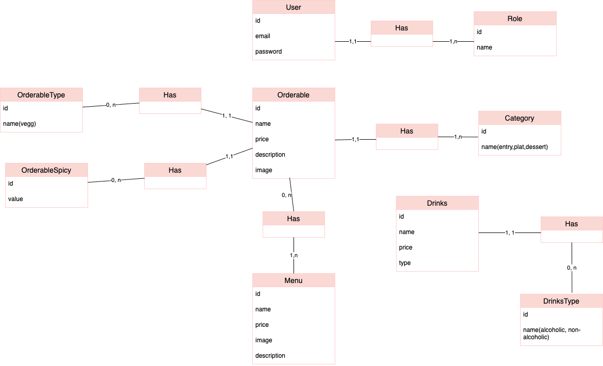
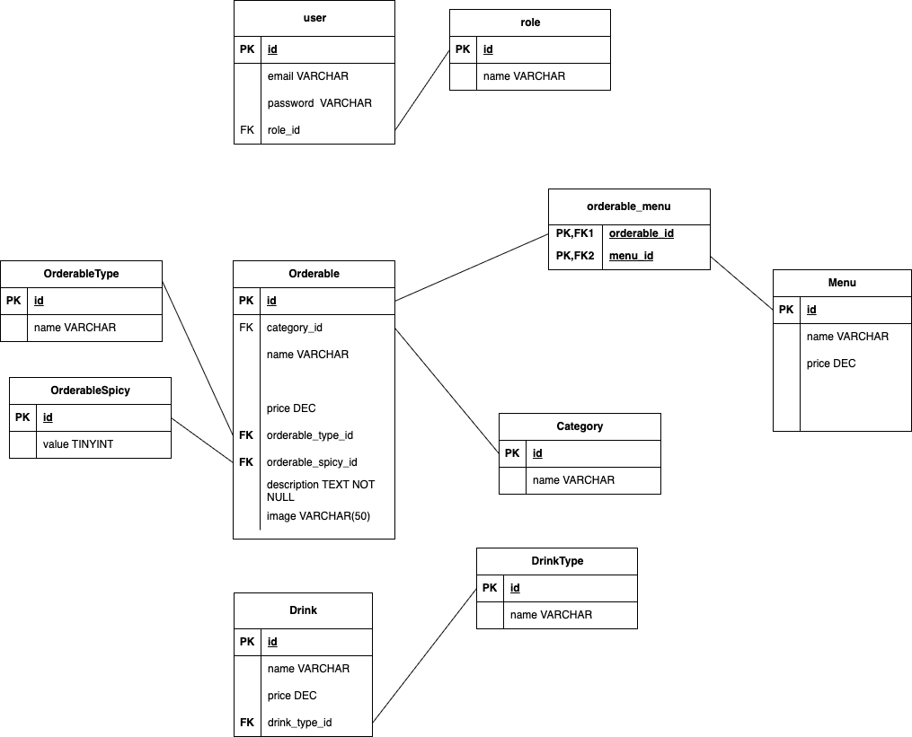
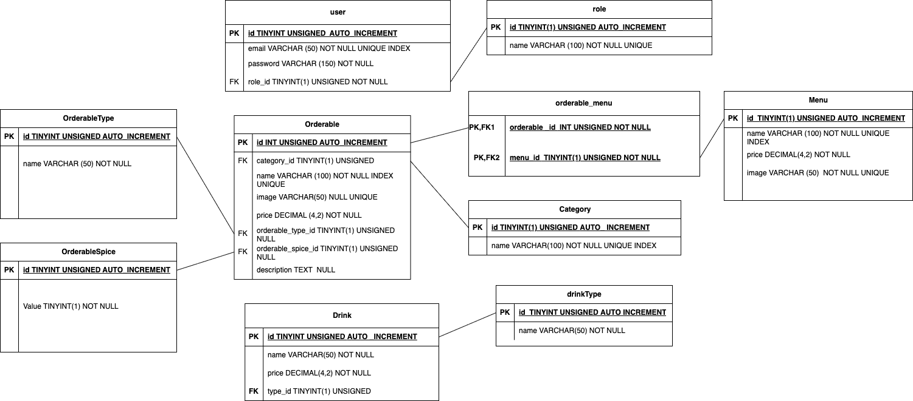

# 14 – Architecture fonctionnelle

## Objectif

Présenter l'architecture fonctionnelle et technique du projet **Le Chemin d'Himalaya** afin de décrire l'organisation du site, l'architecture de l'application ainsi que la modélisation des données réalisée durant la phase d'analyse.

---

# Vue d'ensemble

Le site internet est organisé autour de trois espaces distincts :

- un espace public destiné aux visiteurs ;
- un espace client accessible après authentification ;
- un espace administrateur réservé à la gestion du site.

Cette organisation permet de séparer les fonctionnalités accessibles à tous des fonctionnalités nécessitant une authentification.

---

# Arborescence du site

L'arborescence représente la structure de navigation du site et l'organisation des différentes pages.

Elle distingue :

- les pages publiques ;
- les fonctionnalités accessibles aux utilisateurs connectés ;
- le tableau de bord administrateur.

L'objectif est de faciliter la navigation des utilisateurs tout en séparant clairement les espaces publics et les espaces sécurisés.

---

# Architecture de l'application

L'application repose sur une architecture **Client / Serveur** utilisant le modèle **MVC (Modèle – Vue – Contrôleur)**.

Cette architecture permet de répartir les responsabilités entre plusieurs composants.

| Composant | Description |
|-----------|-------------|
| Navigateur | Reçoit les actions de l'utilisateur et transmet les requêtes au serveur. |
| Routeur | Oriente chaque requête vers le contrôleur correspondant. |
| Contrôleur | Traite les requêtes, applique la logique de traitement et communique avec le modèle. |
| Modèle | Gère les données et les interactions avec la base de données. |
| Vue | Présente les informations à l'utilisateur sous forme d'interface graphique. |

Cette séparation améliore l'organisation du projet, facilite la maintenance du code et permet une meilleure répartition des responsabilités.

---

# Modélisation des données (Méthode Merise)

La conception de la base de données est réalisée selon la méthode **Merise**.

Cette méthode permet de représenter progressivement les données du système avant leur implémentation.

## Modèle Conceptuel des Données (MCD)

Le Modèle Conceptuel des Données représente les principales entités du système ainsi que les relations qui existent entre elles.

Les cardinalités définissent les associations entre les différentes entités.

---

## Modèle Logique des Données (MLD)

Le Modèle Logique des Données traduit le modèle conceptuel en modèle relationnel.

Il introduit les clés primaires et les clés étrangères afin de représenter les relations entre les différentes tables.

---

## Modèle Physique des Données (MPD)

Le Modèle Physique des Données décrit l'implémentation physique de la base de données.

Il précise notamment les types de données utilisés pour chaque attribut ainsi que la structure finale des tables.

---

# Synthèse

L'architecture du projet repose sur :

- une organisation fonctionnelle distinguant les espaces public, client et administrateur ;
- une architecture Client / Serveur basée sur le modèle MVC ;
- une modélisation des données réalisée selon la méthode Merise à travers le MCD, le MLD et le MPD.

Ces éléments permettent d'assurer une organisation cohérente de l'application et de structurer les données conformément aux besoins définis dans le cahier des charges.
