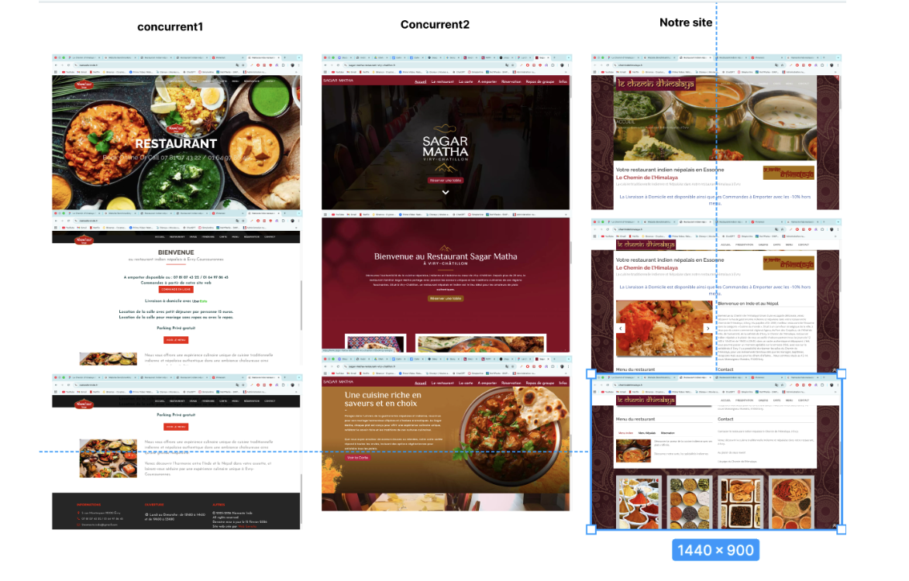
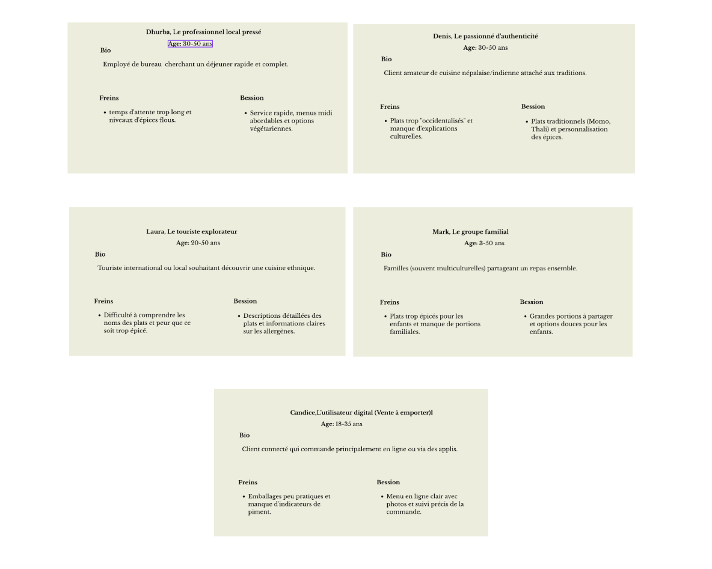
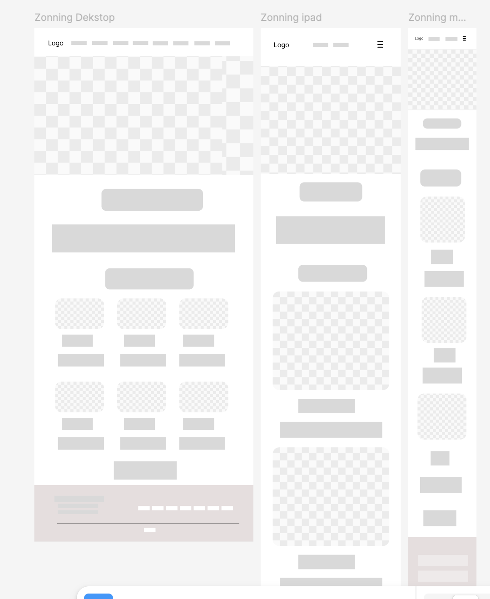
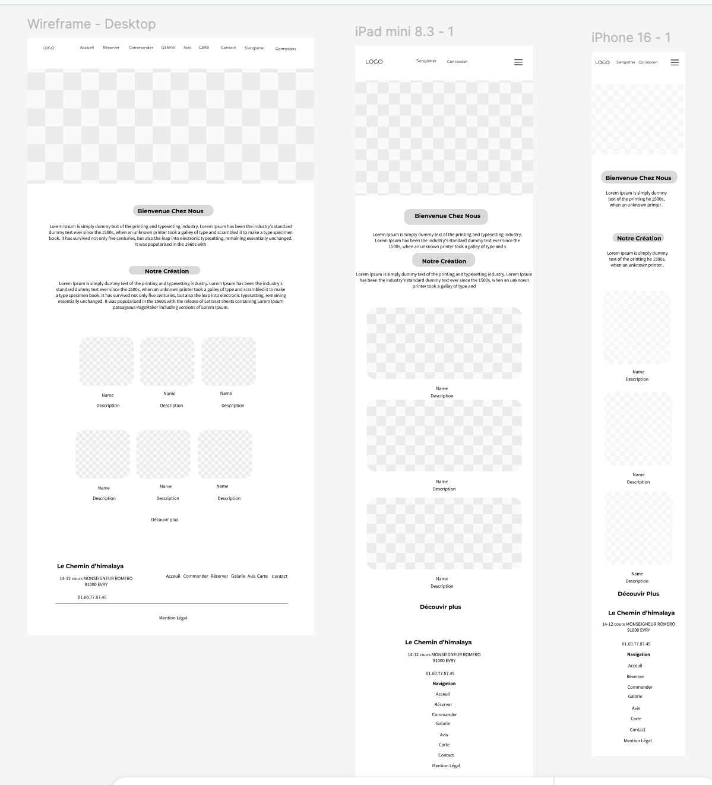

# 16 – Annexes

## Objectif

Cette section regroupe les principaux livrables graphiques réalisés au cours du projet.

---

## Benchmark visuel

Comparaison visuelle des sites étudiés durant le benchmark.

---

## Personas

Présentation des cinq personas définis pour le projet.

---

## Zoning

Zoning réalisé pour définir l'organisation des différentes pages.

---

## Wireframes

Wireframes réalisés pour représenter la structure des interfaces.

---

## Maquettes

Maquettes graphiques du futur site internet.

